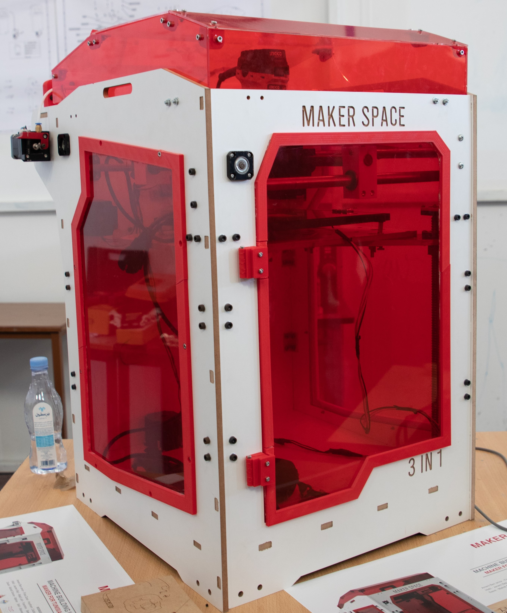
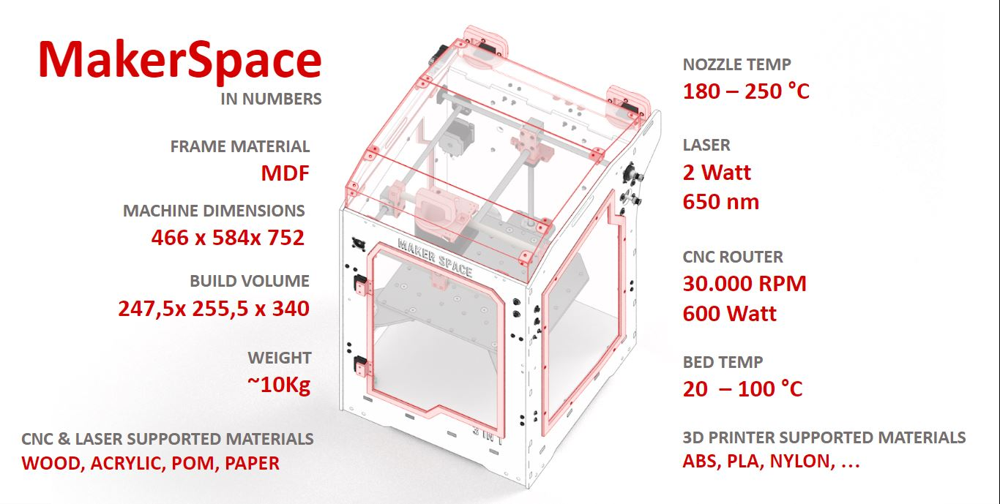
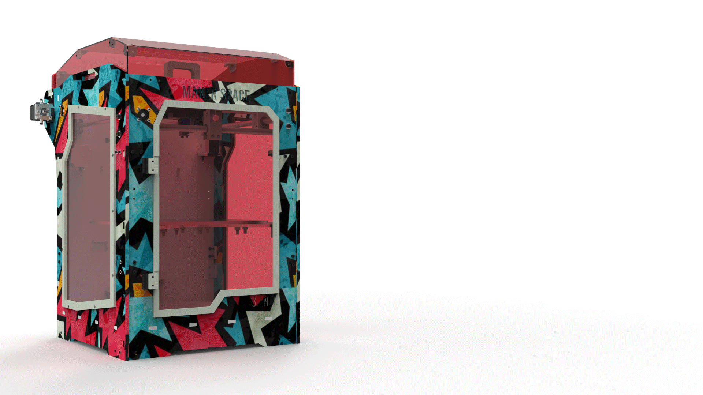

<h1 style="font-family: courier;" align="center">MakerSpace 3-in-1</h1>

<i>Open Source 3-in-1 fabrication machine</i>

# Premises

3D printers are amazing. Unfortunately, they used to be hulking, complicated, expensive, and with limited functions. We’ve been hearing about and experiencing the pain of setting up the difficult-to-use DIY 3D printer kit and being limited by the standard plug-and-play 3D printer. We are hoping to change that. So we came up with an idea: create a 3D printer, which is easy-to-use, expandable for makers, and truly affordable for everyone.

That’s why we designed MakerSpace to be all-in-one.

# MakerSpace 3-in-1
MakerSpace is a Combination of 3 machines which characterizes any maker space or fablab around the word,Powerfull tool for rapid prototyping. Designed for Makers, Desingers, Architects ...

 MakerSpace has been developed using standard [Fab Lab equipment](https://docs.google.com/spreadsheets/d/1U-jcBWOJEjBT5A0N84IUubtcHKMEMtndQPLCkZCkVsU/pub?single=true&gid=0&output=html) and [technique](http://fab.academany.org/2019/schedule.html). MakerSpace was built in [FabLab ENIT](https://www.facebook.com/FabLabENIT/) by Kais Alila and the help of a lot of people (Desingers & Engineers).

 MakerSpace brings the advantages of an open source development:

- full awareness about how FabLab machines works
- reproducible design
- possibility to customize the machine and/or to build new ones
- local self-fixing and self-production of the machine parts
- community can use and improve the design
- cheap alternative to have a desktop FabLab
- use MakerSpace as tool for prototyping

Moreover, It's also a desktop makerspace, a combination of 3D printer, laser engraver, and CNC machine with interchangeable heads. Using FDM (Fused Deposition Modeling), it uses standard 1.75mm 3D printer filament with common [e3d v6](https://e3d-online.com/) extruder, 2 watt Laser module with TTl driver usefull for cutting and engraving on paper, cardbord, 3mm MDF and plexiglass and 500 watt spindle for molding and casting, making pcbs and cutting wood.

MakerSpace was designed starting from two major problems:
-Space factor: With makerspace we are replacing 3 machines so we gain have more space.
-Cost factor: With all-in-one machines we are saving money

# Specifications

**BigFDM specifications**:

- **466mm x 544mm x 752mm** machine dimension
- **247.5mm x 255.5mm x 340mm** working area
- **3 Tools** with interchangeble tools
- **1.75mm** filament
- **0.1 - 0.6mm** nozzle size
- **NEMA 17-23**  stepper motors
- **BallScrews SFU 1204**
- stages with **linear stainless steel rod guides**
- **Wood frame**
- **heated bed**
- **closed housing** of acrylic (enclouser)
- **2 watt 405nm Laser** module with TTL driver
- **30000 Rpm 500 watt** CNC router (Spindle)
- fabbable **Arduino Mega & Ramps and A4988 stepper driver** based electronics
- **Electronics resolution** 6 microns
- PSU 12V 15A
- printing from **USB** drive
- **Materials**:

    -Plastics: PLA, Flex, ABS, Acetal, Acrylic, PVC…

    -Woods: Oak, Maple, Hickory, Walnut…

    -And much more!
- BOM cost of about **1000€**
- power requirements 220V

# Customizable

# Everything is 3D printed

