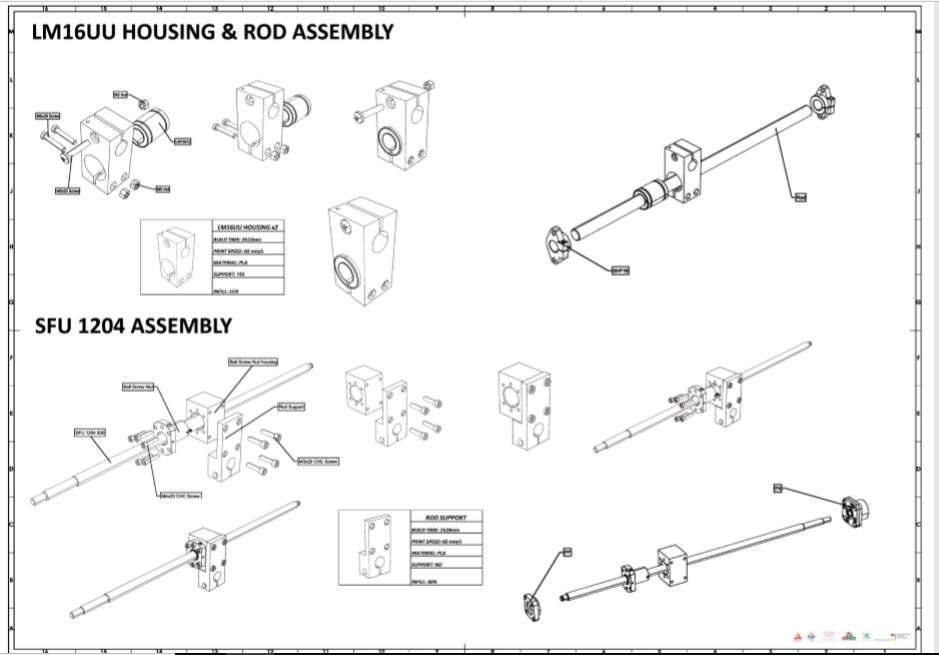

<h1 style="font-family: courier;" align="center">MakerSpace 3-in-1</h1>

<i>Open Source 3-in-1 fabrication machine</i>

# Premises

3D printers are amazing. Unfortunately, they used to be hulking, complicated, expensive, and with limited functions. We’ve been hearing about and experiencing the pain of setting up the difficult-to-use DIY 3D printer kit and being limited by the standard plug-and-play 3D printer. We are hoping to change that. So we came up with an idea: create a 3D printer, which is easy-to-use, expandable for makers, and truly affordable for everyone.

That’s why we designed MakerSpace to be all-in-one.

# MakerSpace 3-in-1
MakerSpace is a Combination of 3 machines which characterizes any maker space or fablab around the word,Powerfull tool for rapid prototyping. Designed for Makers, Desingers, Architects ...

 MakerSpace has been developed using standard [Fab Lab equipment](https://docs.google.com/spreadsheets/d/1U-jcBWOJEjBT5A0N84IUubtcHKMEMtndQPLCkZCkVsU/pub?single=true&gid=0&output=html) and [technique](http://fab.academany.org/2019/schedule.html). MakerSpace was built in [FabLab ENIT](https://www.facebook.com/FabLabENIT/) by Kais Alila and the help of a lot of people (Desingers & Engineers).

 MakerSpace brings the advantages of an open source development:

- full awareness about how FabLab machines works
- reproducible design
- possibility to customize the machine and/or to build new ones
- local self-fixing and self-production of the machine parts
- community can use and improve the design
- cheap alternative to have a desktop FabLab
- use MakerSpace as tool for prototyping

Moreover, It's also a desktop makerspace, a combination of 3D printer, laser engraver, and CNC machine with interchangeable heads. Using FDM (Fused Deposition Modeling), it uses standard 1.75mm 3D printer filament with common [e3d v6](https://e3d-online.com/) extruder, 2 watt Laser module with TTl driver usefull for cutting and engraving on paper, cardbord, 3mm MDF and plexiglass and 500 watt spindle for molding and casting, making pcbs and cutting wood.

MakerSpace was designed starting from two major problems:
-Space factor: With makerspace we are replacing 3 machines so we gain have more space.
-Cost factor: With all-in-one machines we are saving money

# Specifications

**MakerSpace specifications**:

- **466mm x 544mm x 752mm** machine dimension
- **247.5mm x 255.5mm x 340mm** working area
- **3 Tools** with interchangeble tools
- **1.75mm** filament
- **0.1 - 0.6mm** nozzle size
- **NEMA 17-23**  stepper motors
- **BallScrews SFU 1204**
- stages with **linear stainless steel rod guides**
- **Wood frame**
- **heated bed**
- **closed housing** of acrylic (enclouser)
- **2 watt 405nm Laser** module with TTL driver
- **30000 Rpm 500 watt** CNC router (Spindle)
- fabbable **Arduino Mega & Ramps and A4988 stepper driver** based electronics
- **Electronics resolution** 6 microns
- PSU 12V 15A
- printing from **USB** drive
- **Materials**:

    -Plastics: PLA, Flex, ABS, Acetal, Acrylic, PVC…

    -Woods: Oak, Maple, Hickory, Walnut…

    -And much more!
- BOM cost of about **1000€**
- power requirements 220V

# Customizable

# Tools

# Everything is 3D printed

To guarantee the reproducibility of MakerSpace, the majority of the parts are 3D printed in Fab Lab. It took approximately 140 hours print, and 2 kilogramms PLA filament. All the parts are designed with solidworks and Simplify3D for generating the g-code. The spool holder is an open source design designed by [Undeviljur](https://www.thingiverse.com/Undeviljur/about) and this is the thingiverse link:

https://www.thingiverse.com/thing:1546811

This is the table for [3D printed Parts](https://github.com/Fab-Lab-Machines/MakerSpace-3-in-1/tree/master/Fabrication/3D%20printing)

|désignation              |nombre|build time (hour:minute)|plastic weight (g)|lenght (mm)|            |
|-------------------------|------|------------------------|------------------|-----------|------------|
|Box base                 |1     |13:14:00                |175,15            |5840       |            |
|Box-top                  |2     |18:46:00                |194,86            |64812,3    |            |
|Eceres                   |10    |3:17:00                 |31,31             |10412,6    |            |
|extruder housing         |1     |15:39:00                |254,32            |84588,4    |with support|
|FF_housing               |1     |2:14:00                 |26,91             |8949,7     |with support|
|Frame-protection-power   |2     |6:23:00                 |80,49             |26772,2    |            |
|Front protection frame   |1     |7:14:00                 |96,78             |32188,5    |            |
|hinge                    |4     |1:41:00                 |16,45             |5472,4     |            |
|Laser-housing 1st        |1     |7:05:00                 |80,07             |26632,7    |with support|
|Laser-housing second     |1     |7:06:00                 |80,07             |26629,8    |with support|
|LMF_16UU costum          |2     |5:00:00                 |39,65             |13187,5    |            |
|Mors-mobile-extruder     |1     |0:41:00                 |7,02              |2335       |with support|
|Rod support              |1     |1:28:00                 |16,02             |5327,7     |            |
|Rod support 2            |2     |2:59:00                 |32,36             |10762,6    |            |
|Spacer_5_10              |4     |0:20:00                 |2,25              |746,9      |            |
|Support bed & Glass      |1     |10:06:00                |121,82            |40517      |            |
|support end stop         |2     |0:27:00                 |4,42              |1470,5     |            |
|Support FF For SFU1      |2     |2:02:00                 |21                |6985       |            |
|Support on Hinge         |2     |1:23:00                 |14,73             |4899,1     |            |
|Support Rod Bottom       |2     |3:04:00                 |33,01             |10979      |            |
|Spool Holder  (all parts)|1     |10:46:00                |123,32            |41015      |with support|
|Tool holder              |1     |16:48:00                |191,99            |63855,4    |            |
|Tool holder Top          |1     |3:51:00                 |43,46             |14421,6    |            |
|Total :                  |46    |141:40:00               |1687,46           |508800,9   |

# CNC Milling

# Metal parts

# Electronics

<i>Electronic Box</i>

<i>Components</i>

# Compact design

# Machine Details
You can find clear details in the [docs](https://github.com/Fab-Lab-Machines/MakerSpace-3-in-1/tree/master/Docs) folder in this repository.

<i>MakerSpace Details</i>

<i>All Views</i>

<i>Tool Holder Assembly</i>

<i>Rod & Housing Assembly</i>

<i>Tools Assembly</i>

<i>Bed Assembly</i>

<i>Electronic Box Assembly</i>

# Software

MakerSpace uses [Marlin Firmware](https://github.com/MarlinFirmware/Marlin) runing on arduino Mega. The configuration changes have been applied into the configuration.h file, you can find it into the [configuration](https://github.com/Fab-Lab-Machines/MakerSpace-3-in-1/tree/master/Config) folder. The most important modification into the code are for laser and CNC (if we use a variable spindle). To use MakerSpace as laser, you need to connect the laser driver ttl pin to a PWM pin from the ramps (Arduino). To do that I suggest using pin 44 (See AUX-2 from ramps) defined as FAN_Pin and control the laser like a fan or  to define pin 6 as the second fan just add this line to Configuration.h:

- **#define** FAN1_PIN 6 // 2nd fan output attached to laser TTL input

You can then control the laser from your G-code using M106 P1, like so…:

- **M106 P1 S0**   ; Laser off (P1 = 2nd fan output)

- **M106 P1 S128** ; Laser at 50%

- **M106 P1 S255** ; Laser at 100%

**NOTE**: You can use Fan0 if it is available, in which case you will not need to define the above. As of this edit, Marlin can control up to 3 fans via M106/M107. The same commands for variabble spindle (Still need to test)

For CNC Cutting or engraving, we use Fusion 360 to generate the g code using GRBL as post process.

# MakerSpace: Laser Cutting/Engraving
As laser cutter and engraver machine, MakerSpaceis is equiped with 2 watt laser usefull for cutting papers, 3mm wood, 3mm acrylic and engrave on it.
To Generate the G-code, there are diffrent softwares and methods.

The first test for laser was generated using inkscape and [JTP laser tool plug-in](https://jtechphotonics.com/?page_id=2012) realy usefull and easy interface & the g-code generated is compatible with Marlin Firmware.

<i>(https://jtechphotonics.com/?page_id=1980)</i>

The second software tested was [LaserGRBL](http://lasergrbl.com/en/) which is one of the best Windows GCode streamer for DIY Laser Engraver. LaserGRBL is able to load and stream GCode path to arduino, as well engrave images, pictures and logo with internal conversion tool. (more details the website)
we used this software to test image engraving and it is also compatible with Marlin Firmware with some modifications.

# Build your own MakerSpace

MakerSpace is made by using a mix of fabricated and ready-made parts. The ready-made parts are selected to be as common/standard as possible, to make the sourcing of them easy in many countries. For both the raw materials needed for the fabricated parts, and the ready-made parts, refer to the Bill-of-Material for details:

**[MakerSpace BOM](https://github.com/Fab-Lab-Machines/MakerSpace-3-in-1/blob/master/Docs/MakerSpace_BOM%20-%20Feuille%201.pdf)**

The fabrication of the parts mainly relays on standard [Fab Lab equipment](https://docs.google.com/spreadsheets/d/1U-jcBWOJEjBT5A0N84IUubtcHKMEMtndQPLCkZCkVsU/pub?single=true&gid=0&output=html). It will be therefore possible to make MakerSpace in any of Fab Labs worldwide having it. Below a list of the required tools and machines:

- C02 laser cutter:
 - able to cut 3mm acrylic
- large format wood CNC machine:
 - ShopBot or similar, size 2500x1250mm
 - to machine the aluminum parts (bed, Z axis supports)
 - to machine the 8mm MDF parts (frame)
- 3D printer:
 - a small one (30x30x30cm) is sufficient
 - to print all 3D printed parts
- Lathe:
 - To turn two SFU 1204 ball screw
 - to turn some aluminum parts (Baguge for steppers)
- standard set of tools:
 - spanner key set
 - hex key set
 - DIN 875
 - calipers
 - screwdriver set
 - player set (grabber/cutter etc..)
 - rubber hummers

All MakerSpace parts have been modeled Solidworks and all the files are in [CAD](https://github.com/Fab-Lab-Machines/MakerSpace-3-in-1/tree/master/CAD) folder . Using Solidworks is possible to export/prepare the parts for production in the following ways:

- right click save as STL, on a body that needs to be 3D printed
- right click export as DXF, for laser cutting

For more details about the tools and once you have all the fabricated parts available, refer to the for step-by-step assembly instructions and tips: **[MakerSpace Building Manual](https://github.com/Fab-Lab-Machines/MakerSpace-3-in-1/wiki)**

# Media

<iframe width="560" height="315" src="https://www.youtube.com/embed/vwQPz8xjFZ0" frameborder="0" allow="accelerometer; autoplay; encrypted-media; gyroscope; picture-in-picture" allowfullscreen></iframe> 

# Contact

- **alilakais@gmail.com**
- **[Linkedin](https://www.linkedin.com/in/kais-alila-3a1b35163/)**

# Acknowledgements

The development of this machine has been funded by: 
**[German Federal Ministry of Education and Research](https://www.bmbf.de/en/index.html)**

Funds implemented by: 
**[OpenLab Hamburg](http://openlab-hamburg.de/startpage/)** 
[Helmut-Schmidt-Universität Universität der Bundeswehr](https://www.hsu-hh.de/en/) 
Laboratorium Fertigungstechnik 
Holstenhofweg 85 
22043 Hamburg 

# License

# Note
This documentation will be continuously improved as soon there are updates and/or improvements on the machine.
